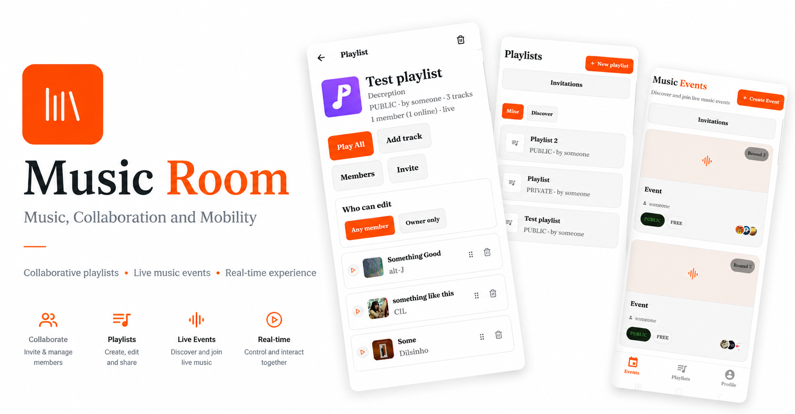
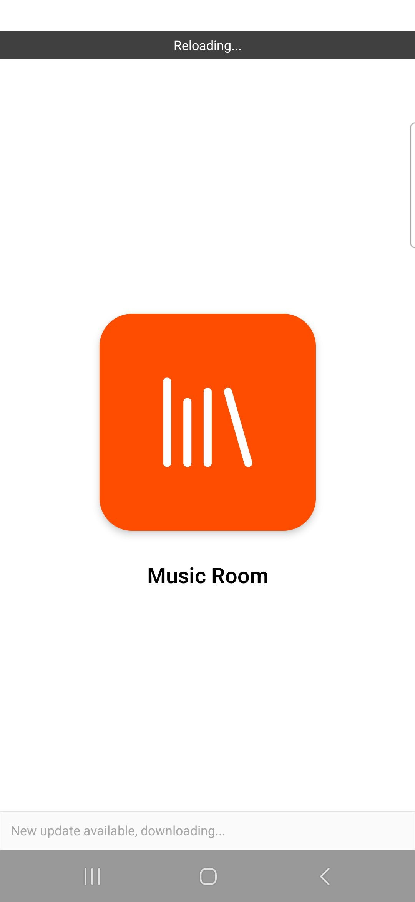
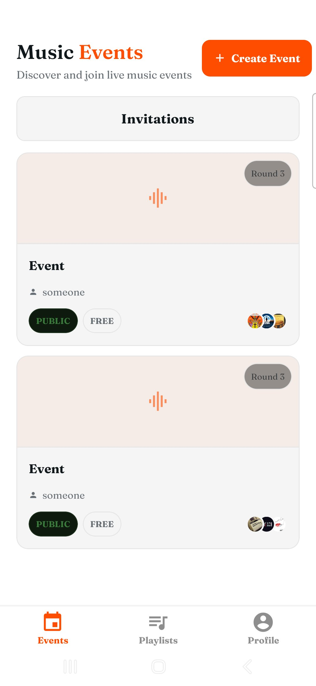
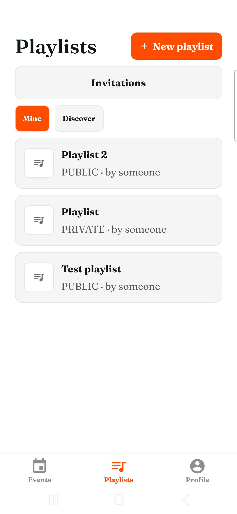
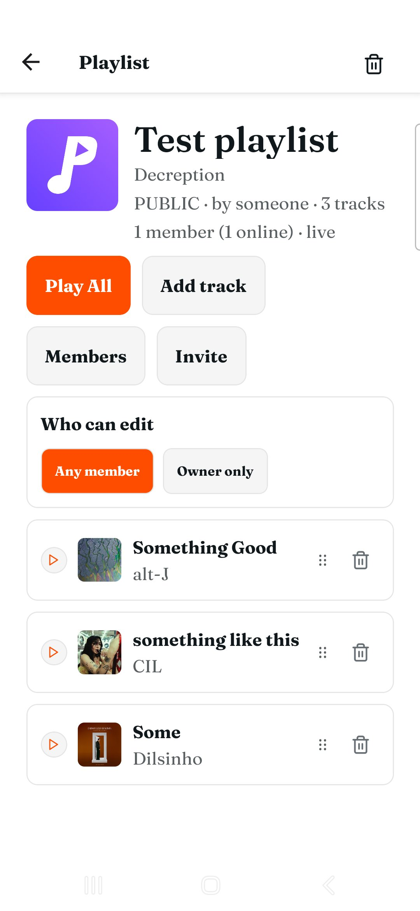
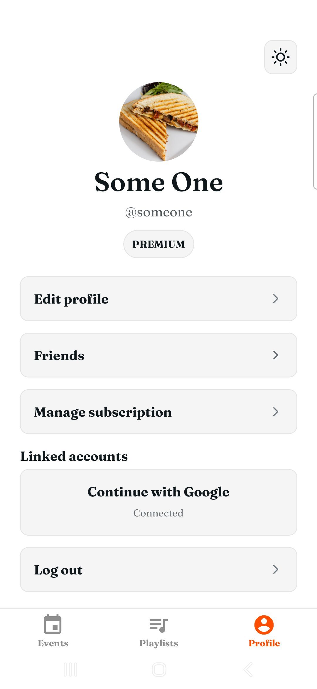

# Music Room



A multi-platform music room app: a NestJS API (`apps/api`), a Next.js web app
(`apps/web`), a React Native / Expo mobile app (`apps/mobile`), and a shared
types package (`packages/types`).

## Screenshots

<p>





</p>

## Getting started

### 1. Fill in `init.sh`

Open [init.sh](init.sh) and replace every `######` placeholder with your own
value. Each one has a comment above it explaining what it is and where to get
it (Gmail app password, Google/Facebook OAuth credentials, Jamendo client ID,
ngrok authtoken and domain, etc).

### 2. Run `./init.sh`

```bash
./init.sh
```

This creates the `.env` files (root, `apps/api`, `apps/web`, `apps/mobile`)
from the values you just filled in, then starts an ngrok tunnel that forwards
to the local nginx gateway (`localhost:8000`, which fronts the api and web
containers). Keep this terminal running — this is what lets the mobile app
reach your machine from a real phone instead of `localhost`.

### 3. In a second terminal, run the backend and web app

```bash
make
```

This builds and starts the Postgres, Redis, api, web, and nginx containers
via Docker Compose.

### 4. In a third terminal, run the mobile app

```bash
make mobile
```

This starts Expo. Scan the QR code it prints with the **Expo Go** app on your
phone to open the app.

## URLs

| What | Where |
|---|---|
| Web app | http://localhost:8000 |
| API | http://localhost:8000/api |
| Swagger docs | http://localhost:8000/api/docs |

## Bonus

- Multi-platform support
- Dark/light mode
- Free subscription vs. Paid subscription
- Statistics for each profile
- Containerisation
